## 开源不易，请各位朋友点个 ***★star★*** 支持一下，非常感谢~

[【 Github地址：https://github.com/Mrkuhuo/data-warehouse-learning 】](https://github.com/Mrkuhuo/data-warehouse-learning)

[【 Gitee 地址：https://gitee.com/wzylzjtn/data-warehouse-learning 】](https://gitee.com/wzylzjtn/data-warehouse-learning)

[【 推荐开发平台：https://github.com/642933588/jiron-cloud 】](https://github.com/642933588/jiron-cloud)

---

## 1 介绍

"《实时/离线数仓实战》是一个以电商系统为基础，围绕电商业务指标统计需求而构建的数仓项目。该项目涵盖了基于Doris、Piamon、Hudi和Iceberg的离线数仓和实时数仓（数据湖）的构建。两种场景在数据处理逻辑上保持一致，但采用了不同的技术实现，为数仓建设提供了多样化的思路。
## 2 技术架构

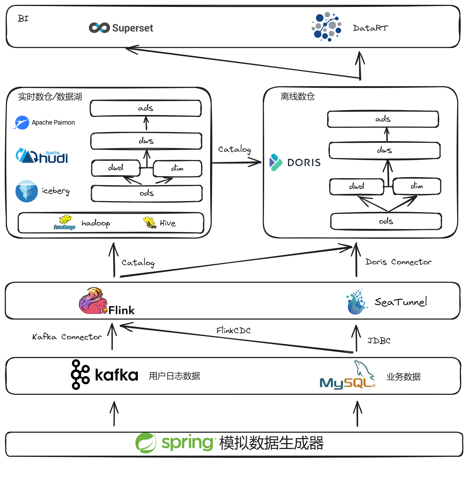

电商数仓项目（实时/离线）的技术架构由四个关键部分组成：

1. 数据源模块：本模块通过 **JAVA** 编写的代码来生成电商业务数据，并将这些数据写入 **MySQL** 数据库。同时，生成的用户日志数据被写入 **Kafka** 消息队列。模块支持在配置文件中设定数据生成的日期，以满足不同时间点的数据需求。

2. 数据采集模块：利用 **Dinky** 开发的 **FlinkSQL** 代码，消费 **Kafka** 中的用户日志数据，并将其写入 **Doris** 、**Paimon** 、 **Hudi** 和 **Iceberg** 的在线数据存储（ODS）层。此外，使用 **DolphinScheduler** 配置 **SeaTunnel** 任务，以同步 **MySQL** 中的业务数据到 **Doris** 的ODS层。**FlinkSQL/CDC** 技术则用于从 **Kafka** 和 **MySQL** 采集数据，并将它们分别写入 **Paimon** 、**Hudi** 和 **Iceberg** 的ODS层。

3. 数仓模块：遵循行业标准的ODS（操作数据存储）-> DWD（数据仓库明细层）/ DIM（维度数据层）-> DWS（数据服务层）-> ADS（应用数据存储）的四级数据分层架构。数据在**Doris** 、**Paimon**、**Hudi** 和 **Iceberg** 中通过批量和实时两种调度方式进行有效流转。

4. 数据可视化：ADS层和DWS层的数据可以利用 **SuperSet** 和 **DataRT** 工具进行报表和数据大屏的制作与展示，以直观地呈现数据洞察。

## 3 软件版本

| 软件               | 版本     | 安装包        | 对应依赖包                                                                                                                                      |
|------------------|--------|------------|--------------------------------------------------------------------------------------------------------------------------------------------|
| Zookeeper        | 3.9.1  | apache-zookeeper-3.9.1-bin.tar.gz       |                                                                                                                                            |
| Kafka            | 3.6.1  | kafka_2.12-3.6.1.tgz       |                                                                                                                                            |
| Seatunnel        | 2.3.3  | apache-seatunnel-2.3.3-bin.tar.gz       | seatunnel-hadoop3-3.1.4-uber-2.3.3-optional.jar                                                                                            |
| Dolphinscheduler | 3.2.0  | apache-dolphinscheduler-3.2.0-bin.tar.gz       | mysql-connector-java-8.0.16.jar                                                                                                            |
| Doris            | 2.0.4  | apache-doris-2.0.4-bin-x64.tar.gz       |                                                                                                                                            |
| Flink            | 1.18.1 | flink-1.18.1-bin-scala_2.12.tgz       | flink-sql-connector-mysql-cdc-2.4.2.jar   flink-sql-connector-kafka-3.1.0-1.18.jar   flink-sql-connector-hive-3.1.3_2.12-1.19.0.jar   flink-connector-jdbc-3.2.0-1.19.jar |
| Iceberg          | 1.5.2  | iceberg-flink-runtime-1.18-1.5.2.jar       |                                                                                                                                            |
| Hudi             | 0.15.0 | hudi-flink1.18-bundle-0.15.0.jar       |                                                                                                                                            |
| Paimon           | 0.8    | paimon-flink-1.18-0.8-20240301.002155-30.jar       | flink-shaded-hadoop-2-uber-2.7.5-9.0.jar                                                                                                   |
| Dinky            | 1.0.0  | dinky-release-1.18-1.0.0-rc4.tar.gz       |                                                                                                                                            |
| Hadoop           | 3.1.3  | hadoop-3.1.3.tar.gz       |                                                                                                                                            |
| Hive             | 3.1.3  | apache-hive-3.1.3-bin.tar.gz       | paimon-hive-connector-3.1-0.7.0-incubating.jar    iceberg-hive-runtime-1.5.2.jar    hudi-hadoop-mr-bundle-0.15.0.jar                 |
| Maven            | 3.9.6  | apache-maven-3.9.6-bin.tar.gz       |                                                                                                                                            |
| Centos           | 8      | CentOS-8.5.2111-x86_64-dvd1.iso       |                                                                                                                                            |
| OpenJDK          | 8      | openlogic-openjdk-8u402-b06-linux-x64.tar.gz       |                                                                                                                                            |

# 通用部分

#### 1) 组件安装

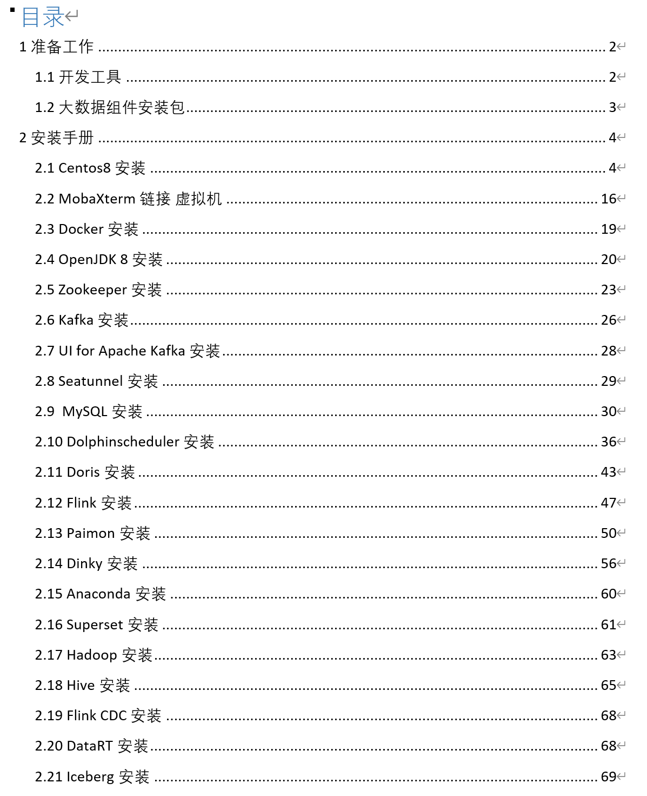

#### 2) 模拟数据生成

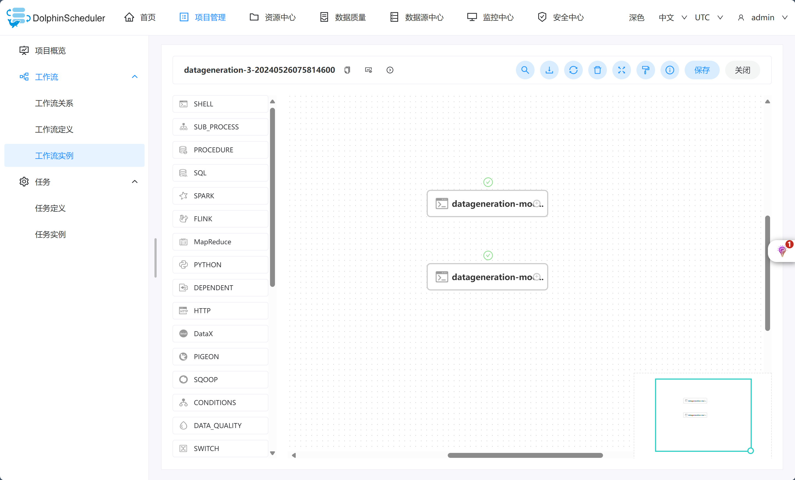

生成业务库数据如下图所示：

生成用户日志数据如下图所示：

# 离线数仓建设部分(Doris)

涉及组件：**Kafka** + **Flink** + **Doris** + **Seatunnel** + **Dolphinscheduler**

#### 1) 数据采集

**Kafka** 数据通过 **Flink** 接入 **Doris**

**MySQL** 数据通过 **SeaTunnel** 接入 **Doris**

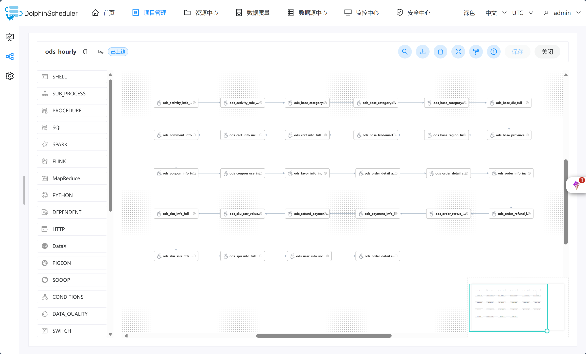

#### 2) **Doris ODS** 层建设

数据采集进 **Doris ODS** 层，实现效果如下图所示：

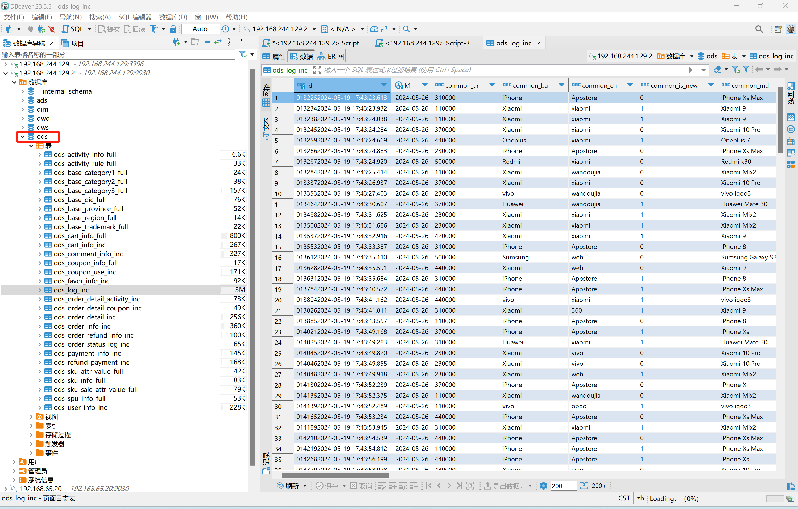

#### 3) **Doris DIM** 层建设

开发 **DorisSQL** 进行 **DIM** 层数据处理

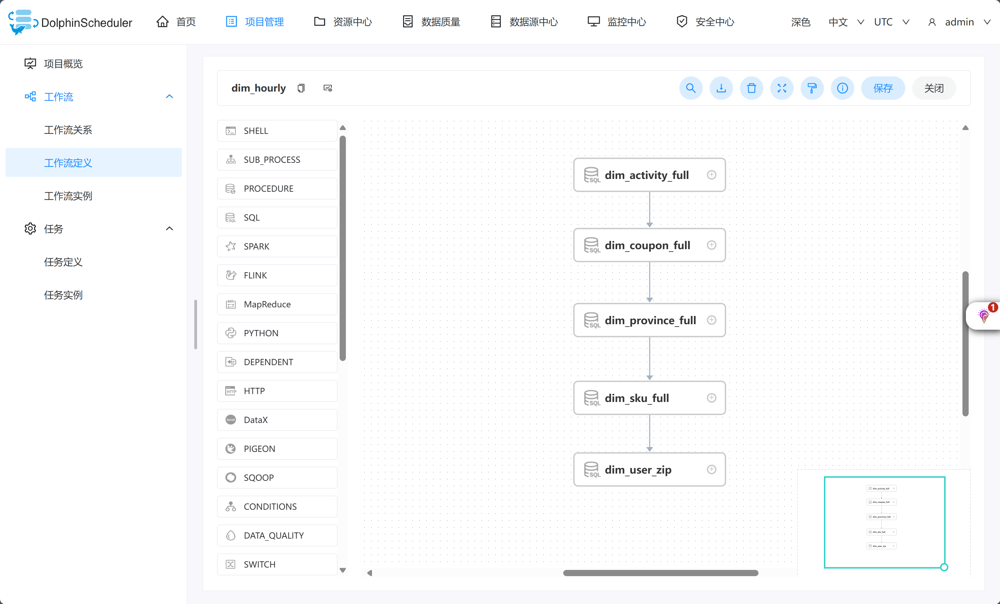

**DIM** 层数据实现效果如下图：

#### 4) **Doris DWD** 层建设

开发 **DorisSQL** 进行 **DWD** 层数据处理

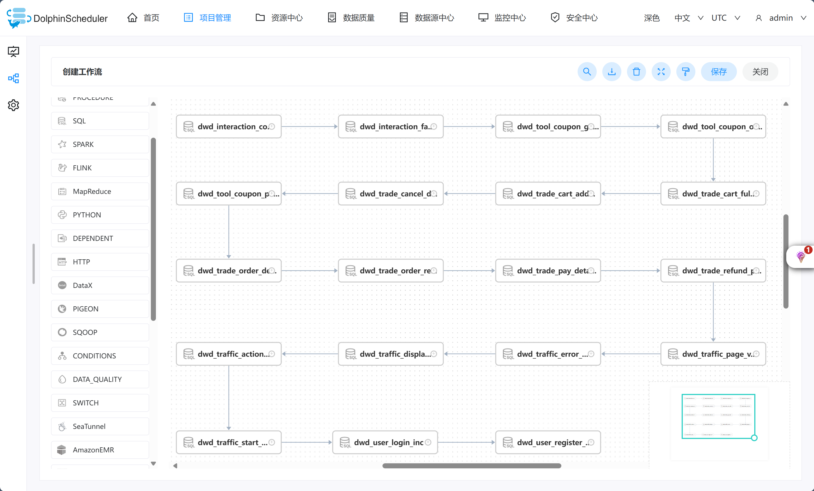

**DWD** 层数据实现效果如下图：

#### 5) **Doris DWS** 层建设

开发 **DorisSQL** 进行 **DWS** 层数据处理

**DWS** 层数据实现效果如下图：

#### 6) **Doris ADS** 层建设

开发 **DorisSQL** 进行 **ADS** 层数据处理

**ADS** 层数据实现效果如下图：

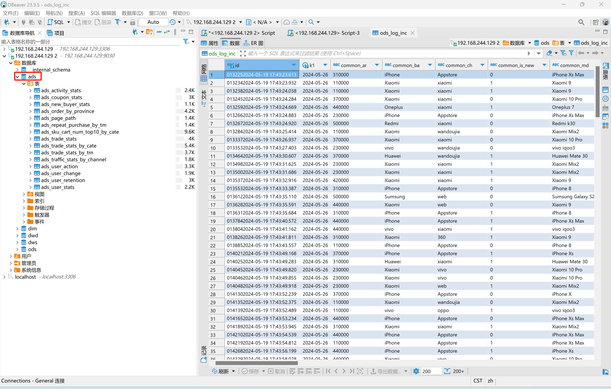

#### 7) 任务编排

最终的任务概览如下图所示

任务编排效果如下图所示

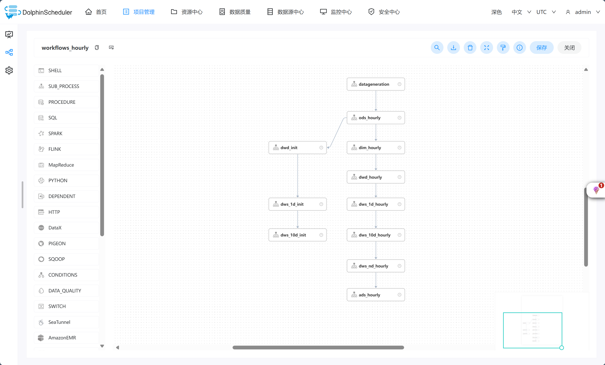

#### 8) 数据展示

# 实时数仓（数据湖）建设部分（Paimon/Hudi/Iceberg）

涉及组件：**Kafka** + **Flink(CDC/SQL/UDF)** + **Paimon/Hudi/Iceberg** + **Hive** + **Dinky**

#### 1) **Paimon ODS** 层建设

**Kafka** 数据通过 **FlinkSQL** 接入 **Paimon/Hudi/Iceberg** ,实际数据落到 **Hive**

**MySQL** 数据通过 **FlinkCDC** 接入 **Paimon/Hudi/Iceberg** ,实际数据落到 **Hive**

数据采集进 **Paimon ODS** 层，实现效果如下图所示：

#### 2) **Paimon DWD** 层建设

开发 **FlinkSQL** 进行 **DWD** 层数据处理

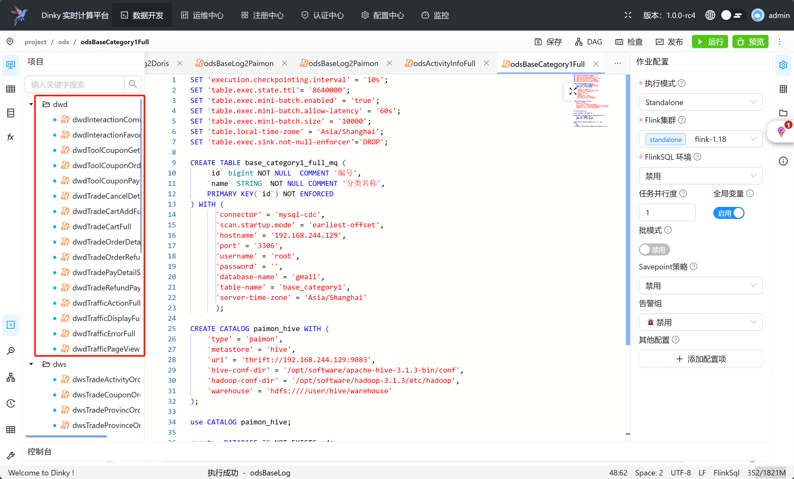

**DWD** 层数据实现效果如下图：

#### 3) **Paimon DIM** 层建设

开发 **FlinkSQL** 进行 **DIM** 层数据处理

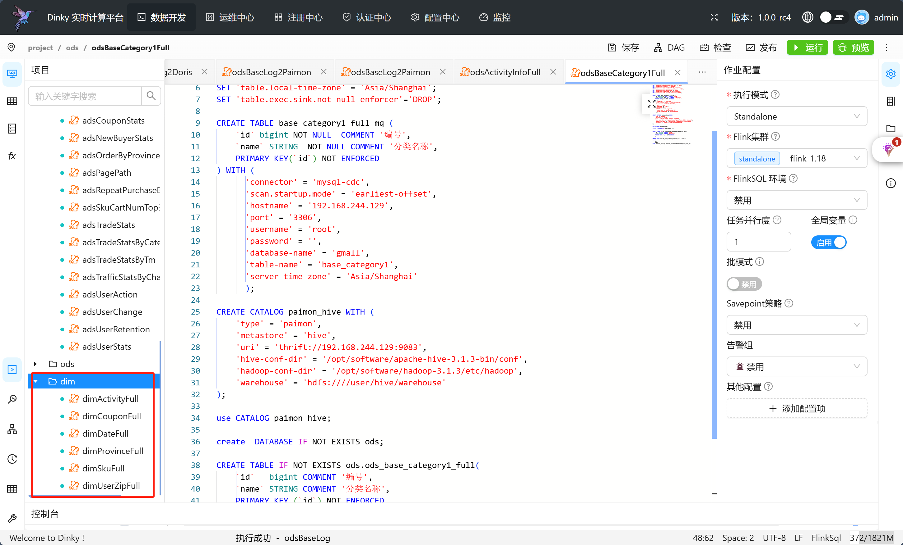

**DIM** 层数据实现效果如下图：

#### 4) **Paimon DWS** 层建设

开发 **FlinkSQL** 进行 **DWS** 层数据处理

**DWS** 层数据实现效果如下图：

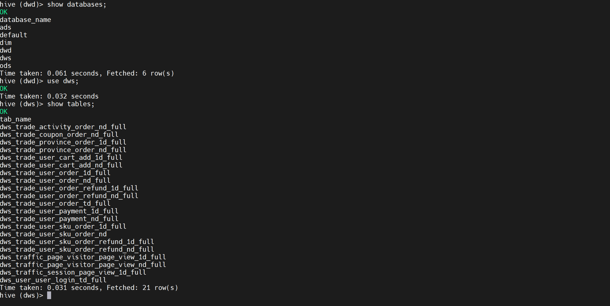

#### 5) **Paimon ADS** 层建设

开发 **FlinkSQL** 进行 **ADS** 层数据处理

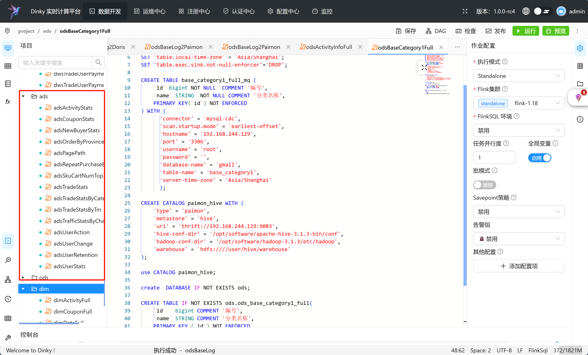

**ADS** 层数据实现效果如下图：

#### 6) **Doris Catalog** 连接 **Paimon** + **DataRT** 进行数据展示

